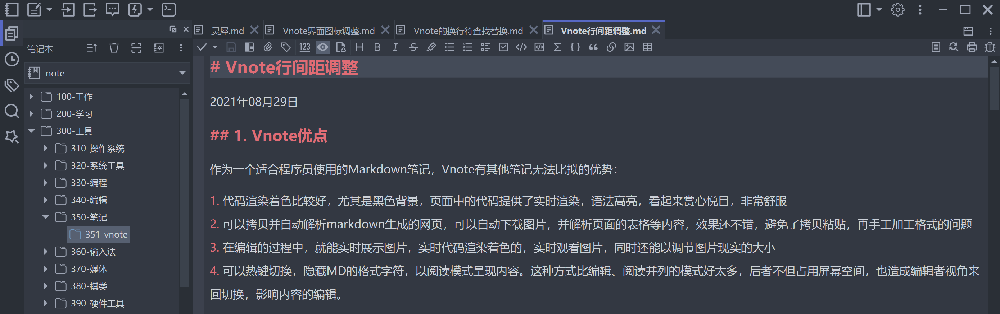

# VNote
  



VNote-refine定制版本主要改动：

Vnote配置数据的两个文件夹缺省保存在应用程序当前目录下。

1. 编辑器的文本之间的行间距拉大，并可配置调整，空白行则不作拉大。 文本行间距，缺省为0.5；代码行间距，缺省为0.2。

1. 快速创建笔记，缺省创建笔记并打开，关闭时自动提醒重命名笔记。 工具栏图标按钮、Ctrl+N、tab空白处双击、无笔记打开时双击背景都可快速创建并打开。 原有模式保留，可通过热键Ctrl+Alt+N激活，选择模板来创建笔记。

1. 当前tab页的笔记文件名加粗体字体显示，其他tab页正常字体。 存在分割窗口的时候，不同窗口内的笔记文件名均加粗，不在当前窗口内的斜体显示。

1. 回车换行的查找替换功能。 正则表达式模式下，支持\n代表的回车换行符的查找和替换。

1. 部分防盗链网页图片下载功能。 在文档头部手工填写referer信息，例如：@@https://cloud.tencent.com/，再拷贝图片链接，即可下载相关图片。

1. 修正快捷键在中文输入法状态下的问题 中文输入法，输入前导键之后，允许字母热键输入。修正片段插入、界面导航存在的小问题。

1. Vnote界面图标和界面的微调。 基于开源免费svg调整了界面图标。

1. Vnote编辑模式下，光标之外的文本块自动隐藏markdown语法标记。

[English](README.md)

[Gitee托管项目](https://gitee.com/vnotex/vnote)

一个舒适的笔记平台！

更多信息，请访问[VNote主页](https://vnotex.github.io/vnote)。


## 简介
**VNote**是一个专注于Markdown的基于Qt的开源免费的笔记应用。VNote希望能提供一个拥有完美编辑体验的舒适的笔记平台。

VNote不是一个简单的Markdown编辑器。通过提供强大的笔记管理，VNote使得使用Markdown记笔记更轻松简单。将来，VNote会支持更多的文档格式。

得益于Qt，VNote当前可以高效地运行在**Linux**，**Windows**，以及**macOS**平台上。


## 下载
基于`master`分支的[持续构建版本发布](https://github.com/vnotex/vnote/releases/tag/continuous-build)。

最新的[稳定版本发布](https://github.com/vnotex/vnote/releases/latest)。其他下载选项：

* [天翼云盘](https://cloud.189.cn/t/Av67NvmEJVBv)
* [百度云盘](https://pan.baidu.com/s/1lX69oMBw8XuJshQDN3HiHw?pwd=f8fk)

## 支持
* [GitHub Issues](https://github.com/vnotex/vnote/issues)；
* 邮件：`tamlokveer at gmail.com`；
* [Telegram](https://t.me/vnotex)；
* 微信公众号：`vnotex`；

感谢这些[捐赠用户](https://github.com/vnotex/vnote/wiki/Donate-List)！

## 开发

克隆仓库后，运行初始化脚本来设置开发环境：

**Linux/macOS:**
```bash
bash scripts/init.sh
```

**Windows:**
```cmd
scripts\init.cmd
```

此脚本将会：
* 初始化并更新所有 git 子模块
* 安装用于自动代码格式化的 pre-commit 钩子（需要 clang-format）
* 设置 vtextedit 子模块的 pre-commit 钩子

更多开发指南，请参考 [AGENTS.md](AGENTS.md)。

## 许可
VNote遵循[GNU LGPLv3](https://opensource.org/licenses/LGPL-3.0)许可。VNote项目的代码可以自由给VNoteX项目使用。
